<p align="center">
  
</p>

# eToro Buddy

A portfolio dashboard for [eToro](https://www.etoro.com) that visualizes your open positions, trade history, and performance metrics. Built with SvelteKit, D3, and Tailwind CSS.

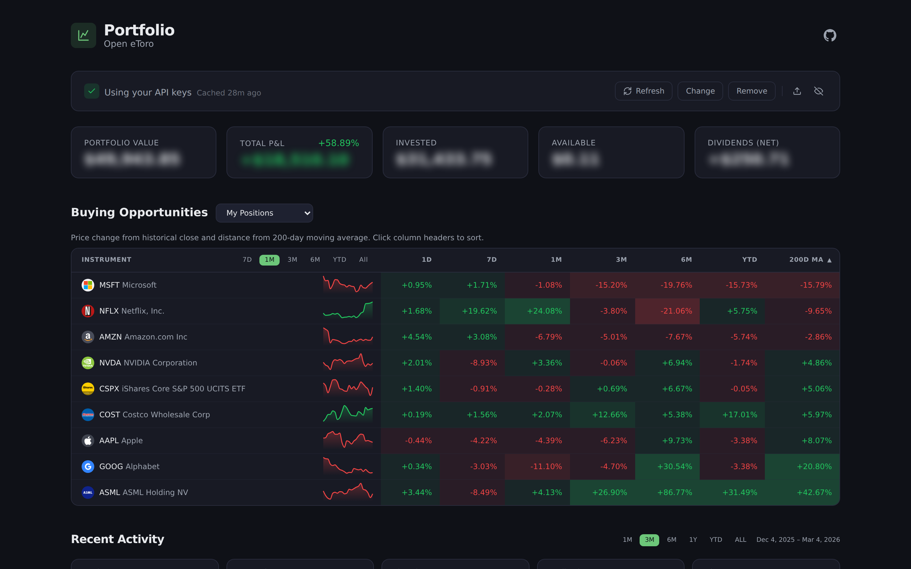

> [!NOTE]
> **Your data stays with you.** All API calls are made directly from your browser to the [eToro API](https://api-portal.etoro.com/) — no intermediary server collects or stores your data. API keys are saved in your browser's `localStorage` and never transmitted anywhere else. This app is a fully static site with no backend, analytics, or tracking.

**Live demo:** [zstundys.github.io/etoro-buddy](https://zstundys.github.io/etoro-buddy/)

> [!IMPORTANT]
> This project is an independent, unofficial tool and is **not affiliated with, endorsed by, or associated with eToro** in any way. "eToro" is a registered trademark of eToro Group Ltd. All product names, logos, and brands mentioned are the property of their respective owners and are used here solely for identification purposes.

## Features

- **Portfolio overview** — total invested, P&L, and per-position breakdowns

  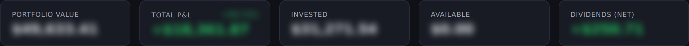

- **Positions table** — sortable, grouped by symbol or date with expandable detail rows

  

- **Buying opportunities** — price change heatmap (1D, 7D, 1M, 3M, 6M, YTD) and 200-day moving average distance for your positions or any watchlist

  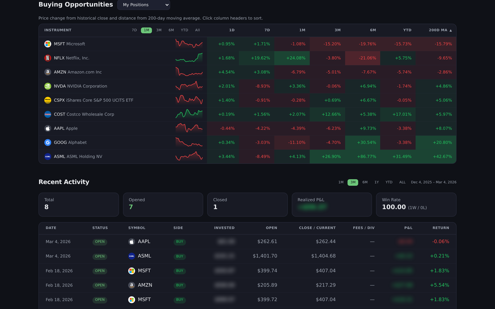

- **Date range filtering** — narrow the view to any time window
- **Recent trades** — latest trade history with buy/sell indicators
- **D3 visualizations:**
  - Portfolio Value Over Time (stacked area)

    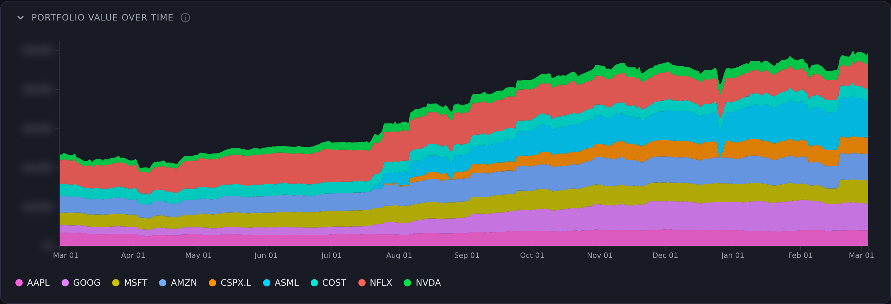

  - Portfolio Allocation (treemap)

    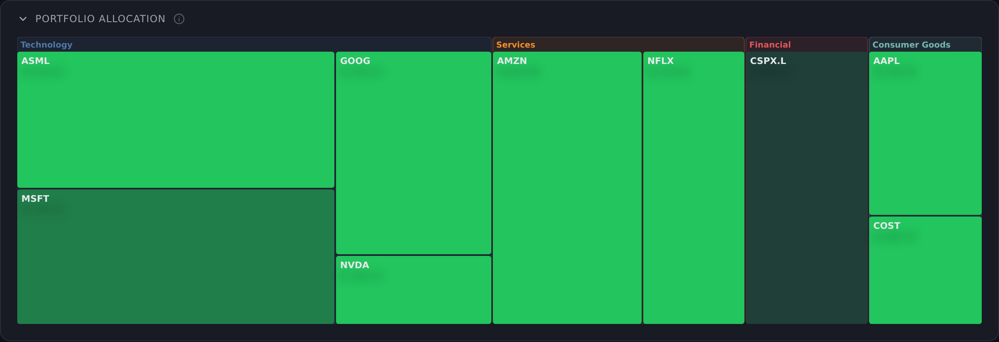

  - Timing vs Performance (bubble scatter)

    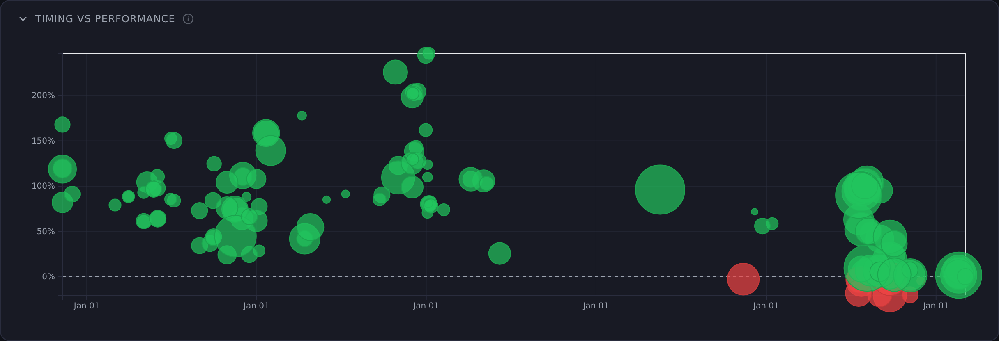

  - Capital Over Time (streamgraph)

    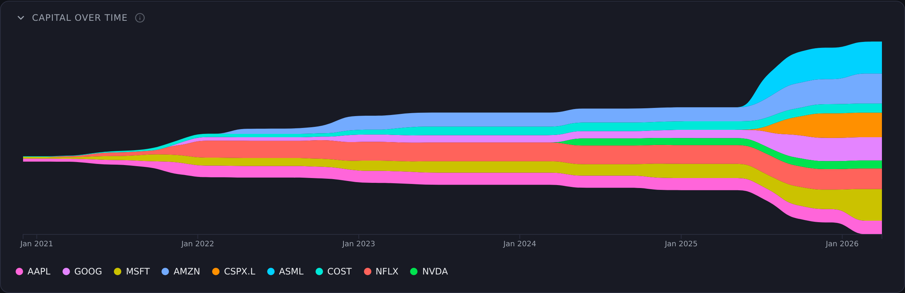

  - Sector Breakdown (sunburst)

    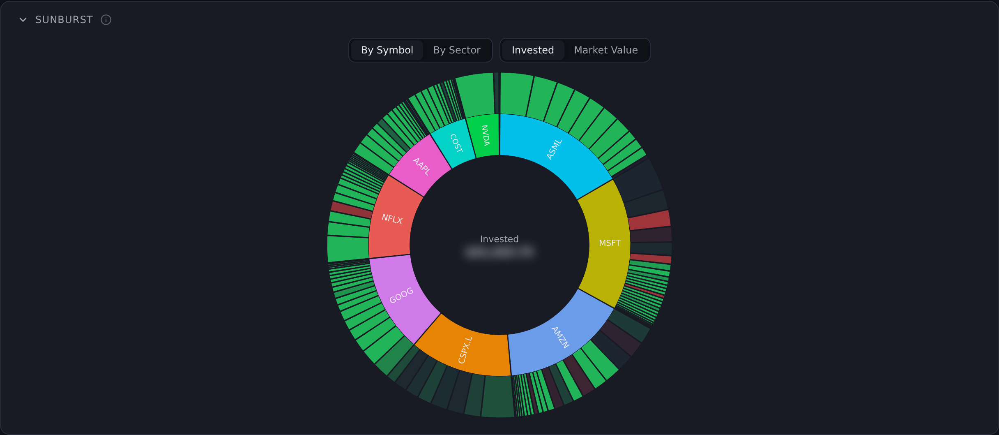

  - P&L Distribution (beeswarm)

    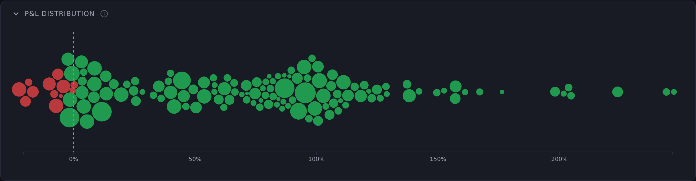

  - Performance Race (normalized line)

    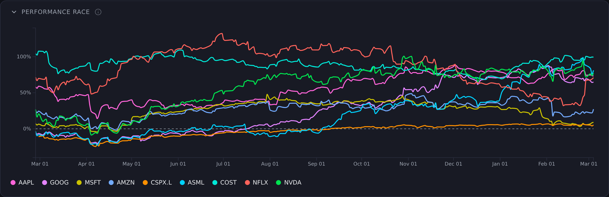

  - Trade Activity (calendar heatmap)

    

  - Price Horizon

    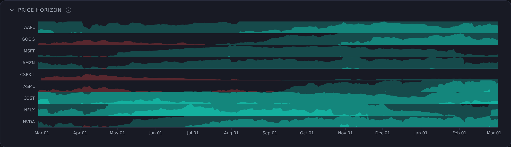

  - Volume Ribbons

    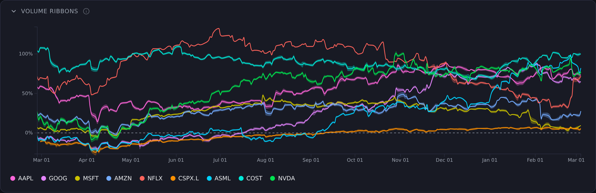

  - Position Lifespans (timeline)

    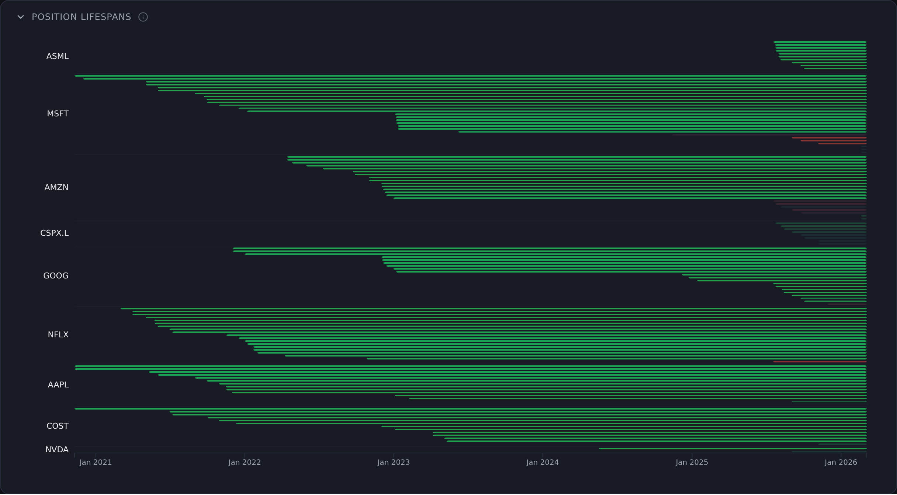

  - Fees & Dividends (waterfall)

    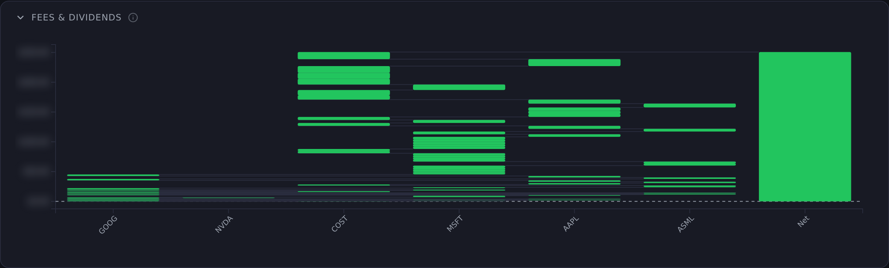

  - Monthly Capital Flow (chord diagram)

    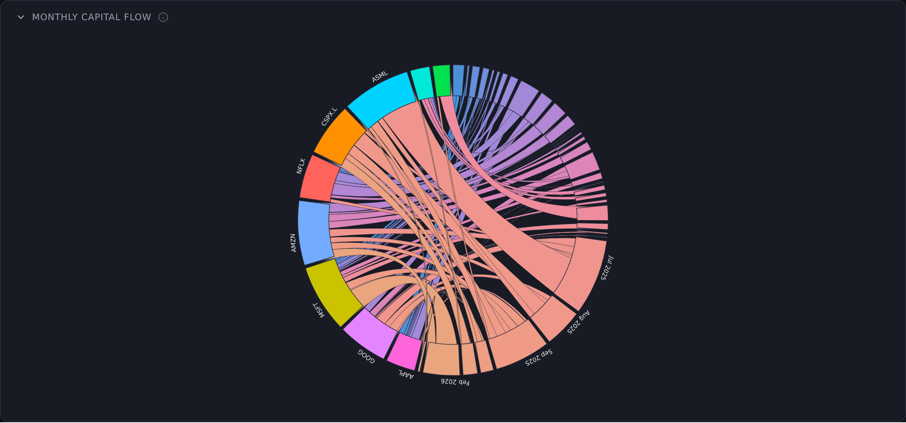

## Getting your API keys

See the [eToro API Portal](https://api-portal.etoro.com/) for full documentation.

1. Log in to [etoro.com](https://www.etoro.com)
2. Go to **Settings → Trading → API Key Management**
3. Create a new key (choose **Real Portfolio** and **Read** permissions)
4. Copy both the **API Key** and **User Key**

## Setup

```sh
bun install
```

### Option A: Client-side only (no server keys)

Just run the app and enter your keys in the UI — data is fetched directly from the eToro API in your browser. Keys are stored in `localStorage` and never leave your machine.

```sh
bun dev
```

### Option B: Server-side keys (local dev)

Create a `.env` file (see `.env.example`):

```
ETORO_API_KEY=your_api_key
ETORO_USER_KEY=your_user_key
```

```sh
bun dev
```

The server loads data on page render. You can still override with client-side keys in the UI.

## Screenshots

Regenerate the README screenshots with Playwright. Requires a running dev server with API keys configured in `.env`:

```sh
bun dev &
bun run screenshots
```

The built-in privacy mode is enabled before capture to blur sensitive values. Output goes to `screenshots/`.

## Building

Static build (for deployment):

```sh
bun run build
```

Output goes to `build/`. The site is a fully static SPA — no server required.

## Deployment

Pushes to `main` automatically build and deploy to GitHub Pages via the included workflow (`.github/workflows/deploy.yml`).

To deploy elsewhere, serve the `build/` directory from any static host.
